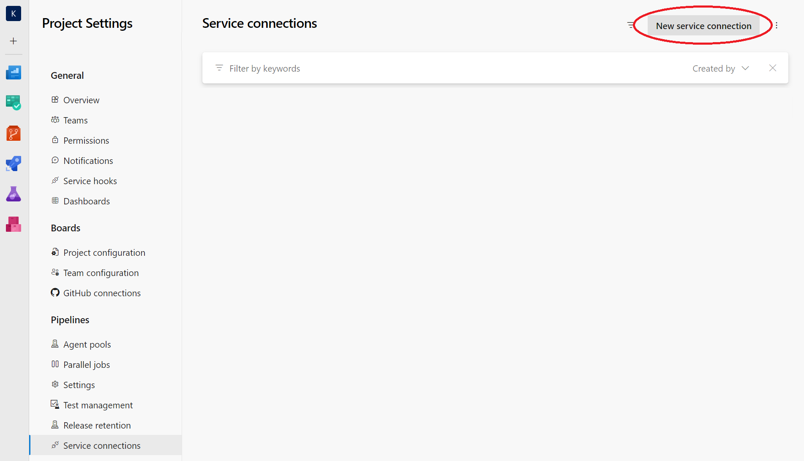
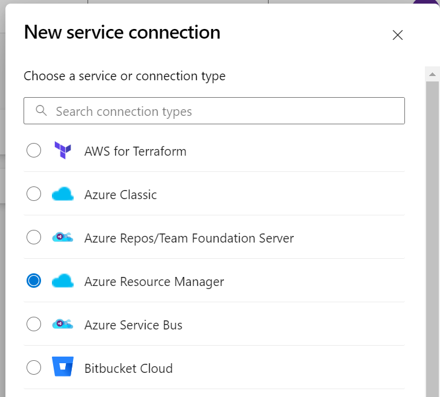
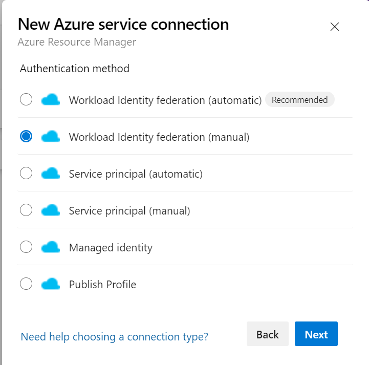
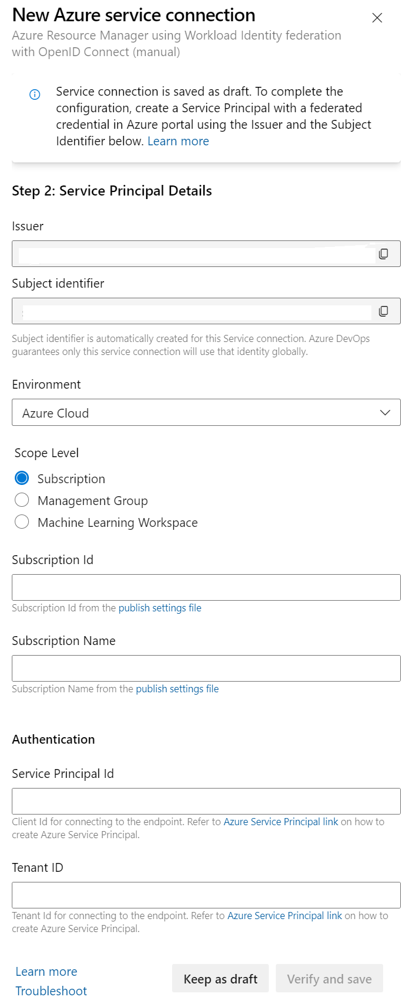
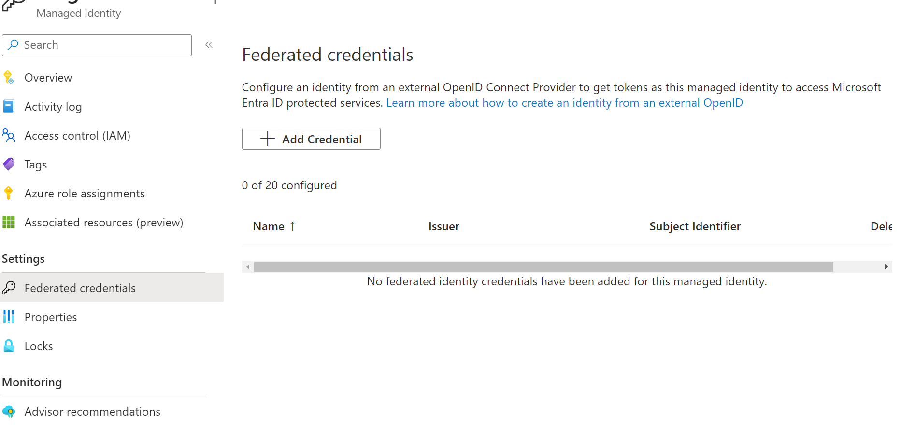

# Opprette MI med federated credentials i Azure DevOps
Dette er en kort guide som forklarer hvordan man kan opprette en Managed Identity (MI) i Azure, og bruke denne til å autentisere seg mot Azure DevOps.

MI-er har flere egenskaper som gjør at de mer egnet enn app registrations som identiteter for IaC:

* Det kreves ingen unormale privilegier i Entra ID for å opprette en MI.
* Man kan ikke autentisere seg som en MI ved hjelp av en statisk hemmelighet, slik man kan med en app registration. Federated credentials er eneste mulighet.
* De mangler mange ekstra funksjonaliteter som app registrations har, og det gjør det vanskeligere å misbruke dem, og det gjør det enklere for utenforstående å skjønne hva de brukes til. MI-er kan kun være klienter, mens app registrations kan representere både klienter og ressurser.

## 1. 
Lag en User-Assigned Managed Identity (MI) i Azure. En MI er representert som en ressurs i Azure *og* en Enterprise Application i Entra ID (Azure AD). Det kreves ingen spesielle rettigheter i Entra ID for å opprette en MI.

Dette kan gjøres i Azure Portal, eller med Azure CLI. Med Azure CLI

```az identity create --name <name> --resource-group <resource-group> --subscription <subscription-id>```

Noter ned MIen sin "Client ID", din subscription sin ID og navn og Hafslund sin "Tenant ID".

## 2. 
Lag en *service connection* i Azure DevOps. En service connection er en abstraksjon som kobler (1) en identitet i Azure, (2) en subscription i Azure og (3) et prosjekt i Azure DevOps. Klikk tannhjulet nede til venstre i Azure Devops, og velg "Service connections".


Velg "Azure Resource Manager"


Velg "Workload Identity federation (manual)"


Fyll inn subscription ID, tenant ID og client ID fra steg 1. Kopier verdiene i feltene "Issuer" og "Subject Identifier". Velg "Save".


## 3. 
Naviger til MIen du laget i steg 1, og velg "Federated credentials".


Velg "Add credential", "Other", og lim inn verdiene fra steg 2. Velg "Add".

## 4. 
Gi MIen din de RBAC-privilegier som er nødvendig for å gjøre det du ønsker å gjøre. Dette kan gjøres i Azure Portal, eller med Azure CLI. Med Azure CLI:

```az role assignment create --role <role> --assignee <client-id> --scope <scope>```

e.g. for å gjøre MIen Owner på scope av hele din subscription

```az role assignment create --role Owner --assignee <client-id> --scope /subscriptions/<subscription-id>```